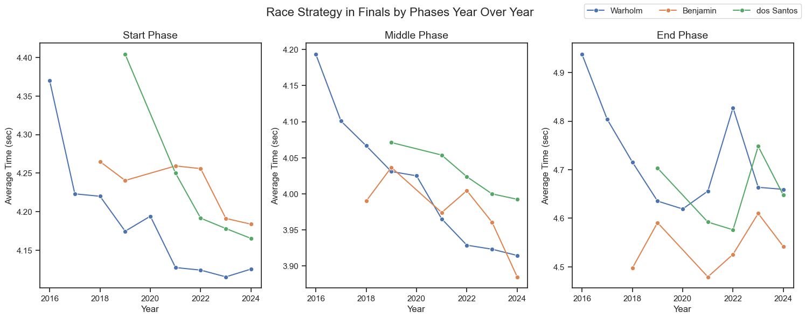

# Overview
This project examines the race strategies and career paths of the three greatest 400 meter hurdle athletes of all time: Karsten Warholm, Rai Benjamin, and Alison dos Santos. The analysis was created with an intent to investigate the components of their races, as well as their year over year improvement, to determine the unique strategies that separate these athletes from the rest of history. This report covers detailed race plans, step patterns, yearly shifts, and other aspects of the 400 meter hurdle race.

This project includes several detailed visualizations created with Python libraries as well as an interactive dashboard containing visualizations created with Power BI (IN PROGRESS).

All of the data for this project was sourced from [Athlete First](athletefirst.org), a site dedicated to providing sprint splits and hurdle touchdown times as resources for athletes and coaches. The file I referenced can be found online [here](https://www.athletefirst.org/wp-content/uploads/2025/06/Mens-400m-Hurdles-by-athlete-20250520.pdf).
# Background
The 400 meter hurdles is widely considered to be one of the most difficult, if not the hardest, events in the sport of track and field. Athletes competing in the 400 meter hurdles face the event's unique mixture of speed, endurance, and hurdle technique. Until 2021, the world record in this event on the men's side stood at 46.78, set by Kevin Young of the United States at the 1992 Summer Olympics. In the span of two months, however, three men would go on to decimate the nearly 29-year-old record in a fashion that no other track event has seen before. 

Racing in the Tokyo Summer Olympics finals were Karsten Warholm of Norway, Rai Benjamin of the United States, and Alison dos Santos of Brazil. In what would become known as the greatest 400 meter hurdle race of all time, all three men shattered Kevin Young's mark, crossing the finish line in 45.94, 46.17, and 46.72 seconds respectively. 

Throughout the next 4 years, these athletes would cement their spots as the three fastest 400 meter hurdlers of all time. As of July 2025, out of the top 32 marks in the event, 31 of those races were ran by these three men. Because of their absolute dominance in this event, this analysis focuses on discovering why and how Warholm, Benjamin, and Dos Santos consistently stay leagues ahead of their competition.
# Essential Questions
Below are the overarching questions answered through this project's analysis:
1. How do the race strategies of Warholm, Benjamin, and dos Santos differ over the course of a race?
2. Which part of the 400 meter hurdle race most strongly predicts final results?
3. What varying stride patterns are used by these athletes and how do they affect their performance?
4. How has each athlete's race strategy and overall time evolved over their careers?
# Tools Used
Throughout my analysis, several tools and libraries were utilized in order to complete analysis more efficiently and generate complex visualizations:
- **Python**: Backbone of project; used for data cleanup, reading and transformation
- **Pandas Library**: For data analysis
- **Matplotlib Library**: For data visualization
- **Seaborn Library**: For advanced data visualization techniques
- **Jupyter Notebooks**: Used to run Python Scripts and create analyses
- **Google Sheets**: To organize data to be read into Python.
- **Visual Studio Code**: Used to execute Python scripts
- **Github**: Used for version control and to share the analysis publicly
# Analysis
## How do the race strategies of Warholm, Benjamin, and dos Santos differ over the course of a race?

### Generating Visualizations
```python

```
### Result

### Insights

## Which part of the 400 meter hurdle race most strongly predicts final results?

### Generating Visualizations
### Individual Correlations
```python
fig, ax = plt.subplots(11,figsize=(6,16))
for i, column in enumerate(all_columns):
    sns.lineplot(data=df_splits_finals,x='Time',y=column, errorbar=None, ax=ax[i])
    x=df_splits_finals['Time']
    y=df_splits_finals[column]
    slope, intercept, r_value, p_value, std_err = linregress(x,y)
    x_range = np.linspace(x.min(), x.max(), 100)
    y_pred = slope * x_range + intercept
    ax[i].plot(x_range, y_pred, color='red', label='Regression',alpha=r_squared)
plt.show()
```
### Result


### Correlation Summary
```python
sns.barplot(x=list(r_squared_sorted.keys()),y=list(r_squared_sorted.values()),hue=list(r_squared_sorted.keys()),palette='rocket')
plt.show()
```

### Result


### Insights

## What varying stride patterns are used by these athletes and how do they affect their performance?

### Generating Visualizations
```python

```
### Result

### Insights

## How has each athlete's race strategy and overall time evolved over their careers?

### Generating Visualizations
### Year Over Year Time and Stride Pattern
```python
fig, ax = plt.subplots(2,figsize=(9,7))
sns.lineplot(data=df_warholm_s_2024_finals,x='Year',y='Time', errorbar=None, ax=ax[0], label='Warholm',marker='o')
sns.lineplot(data=df_benjamin_s_2024_finals,x='Year',y='Time', errorbar=None, ax=ax[0], label='Benjamin',marker='o')
sns.lineplot(data=df_dossantos_s_2024_finals,x='Year',y='Time', errorbar=None, ax=ax[0], label='dos Santos',marker='o')
sns.lineplot(data=df_stride_percents,x='Year',y='Normal_Stride',hue='Athlete',ax=ax[1],marker='o')
plt.show()
```
### Result


### Year Over Year Phases
```python
fig, ax = plt.subplots(1, 3, figsize=(15,6))
sns.lineplot(data=df_splits_2024,x='Year',y='Start_Phase',hue='Athlete',errorbar=None, marker='o', ax=ax[0])
sns.lineplot(data=df_splits_2024,x='Year',y='Mid_Phase',hue='Athlete',errorbar=None, marker='o', ax=ax[1])
sns.lineplot(data=df_splits_2024,x='Year',y='End_Phase',hue='Athlete',errorbar=None, marker='o', ax=ax[2])
plt.show()
```
### Result


### Insights

# Lessons

# Sources of Error

# Conclusion
